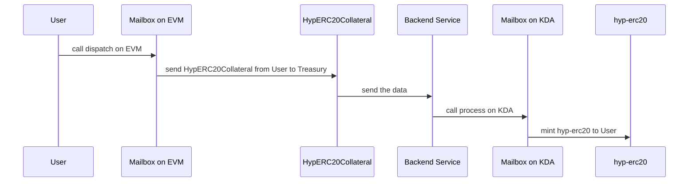
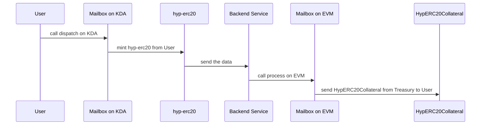
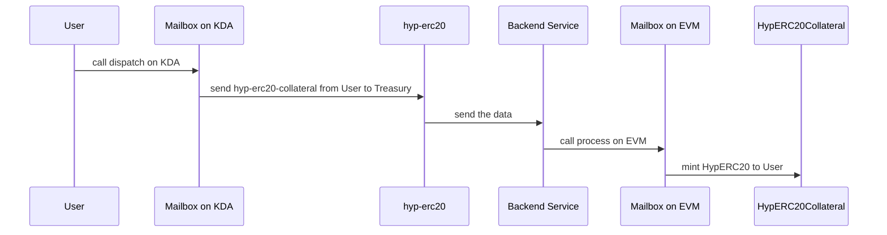
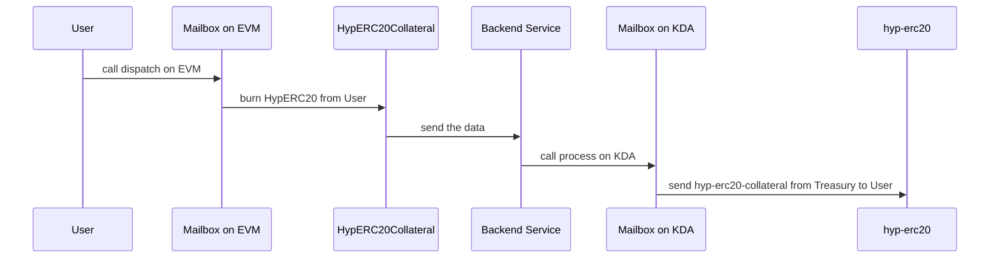

## Sequence Diagram

### ETH Collateral => KDA Synthetic

**from ETH to KDA**

```mermaid
sequenceDiagram
    participant U as User
    participant MEVM as Mailbox on EVM
    participant EVM as HypERC20Collateral
    participant BE as Backend Service
    participant MKDA as Mailbox on KDA
    participant KDA as hyp-erc20

    U->>MEVM: call dispatch on EVM
    MEVM->>EVM: send HypERC20Collateral from User to Treasury
    EVM->>BE: send the data
    BE->>MKDA: call process on KDA
    MKDA->>KDA: mint hyp-erc20 to User
```

**from KDA to ETH**

```mermaid
sequenceDiagram
    participant U as User
    participant MKDA as Mailbox on KDA
    participant KDA as hyp-erc20
    participant BE as Backend Service
    participant MEVM as Mailbox on EVM
    participant EVM as HypERC20Collateral

    U->>MKDA: call dispatch on KDA
    MKDA->>KDA: mint hyp-erc20 from User
    KDA->>BE: send the data
    BE->>MEVM: call process on EVM
    MEVM->>EVM: send HypERC20Collateral from Treasury to User
```

# KDA Collateral => ETH Synthetic

**from KDA to ETH**

```mermaid
sequenceDiagram
    participant U as User
    participant MKDA as Mailbox on KDA
    participant KDA as hyp-erc20
    participant BE as Backend Service
    participant MEVM as Mailbox on EVM
    participant EVM as HypERC20Collateral

    U->>MKDA: call dispatch on KDA
    MKDA->>KDA: send hyp-erc20-collateral from User to Treasury
    KDA->>BE: send the data
    BE->>MEVM: call process on EVM
    MEVM->>EVM: mint HypERC20 to User
```

**from ETH to KDA**

```mermaid
sequenceDiagram
    participant U as User
    participant MEVM as Mailbox on EVM
    participant EVM as HypERC20Collateral
    participant BE as Backend Service
    participant MKDA as Mailbox on KDA
    participant KDA as hyp-erc20

    U->>MEVM: call dispatch on EVM
    MEVM->>EVM: burn HypERC20 from User
    EVM->>BE: send the data
    BE->>MKDA: call process on KDA
    MKDA->>KDA: send hyp-erc20-collateral from Treasury to User
```
