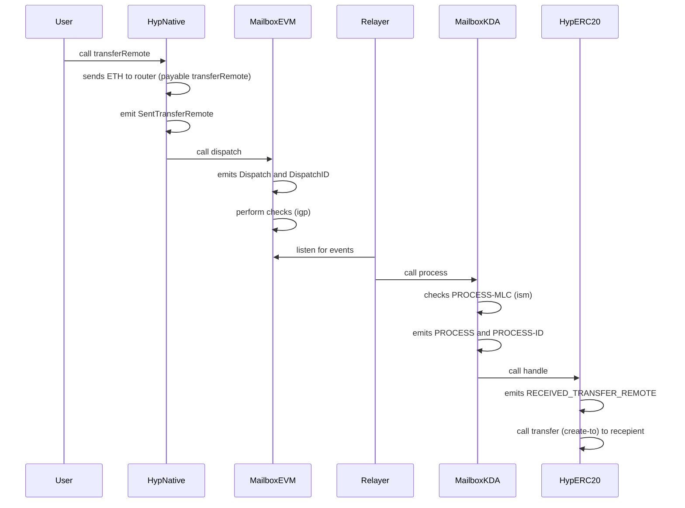
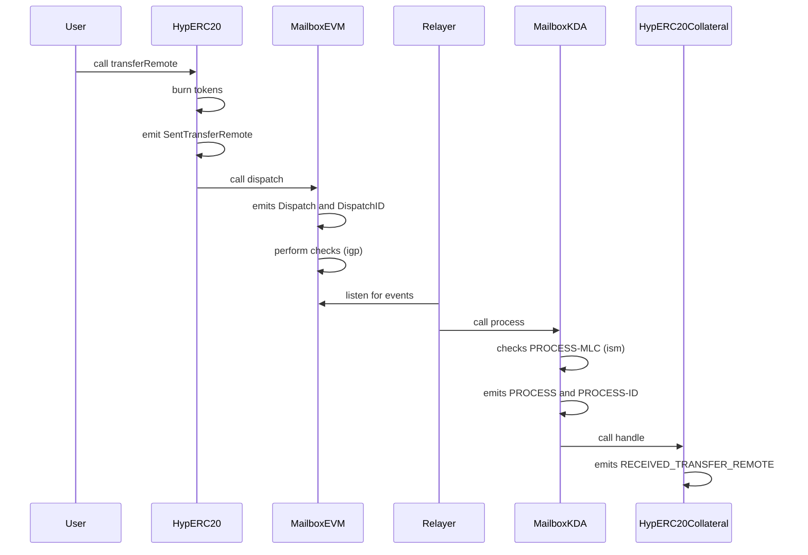
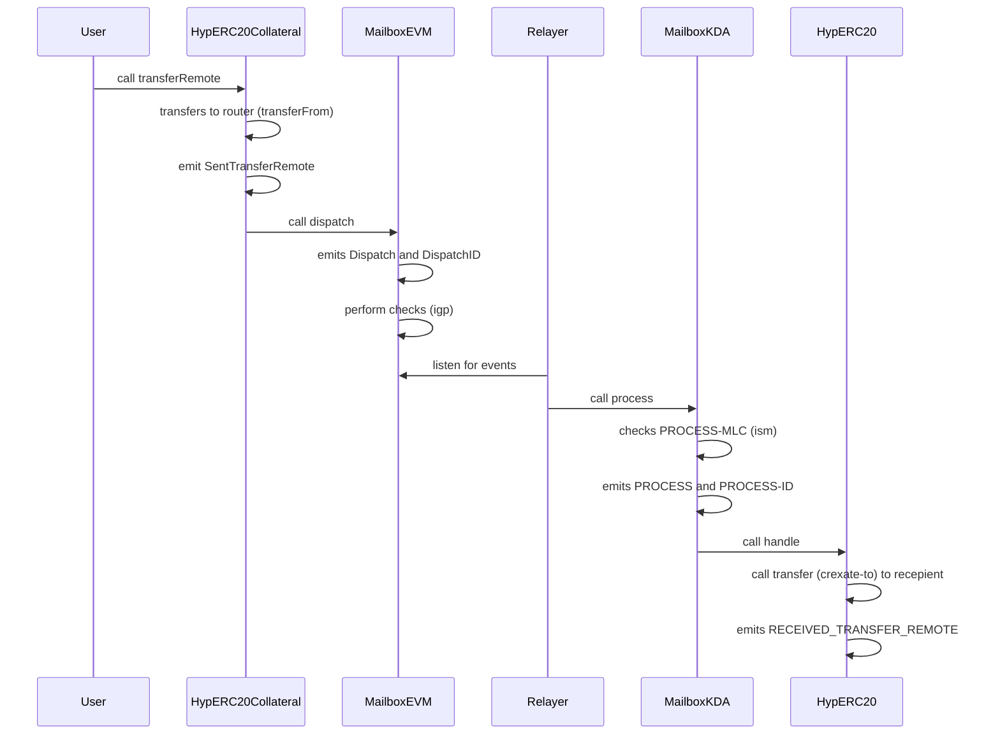
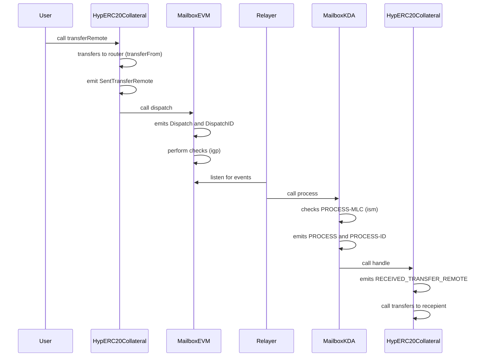
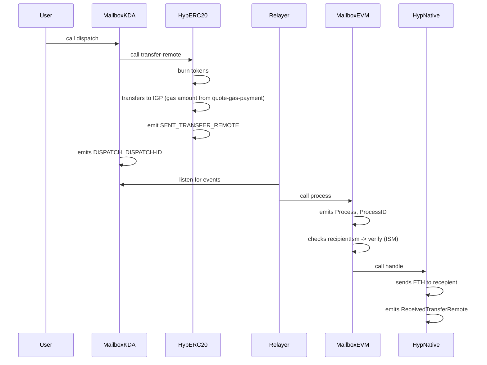
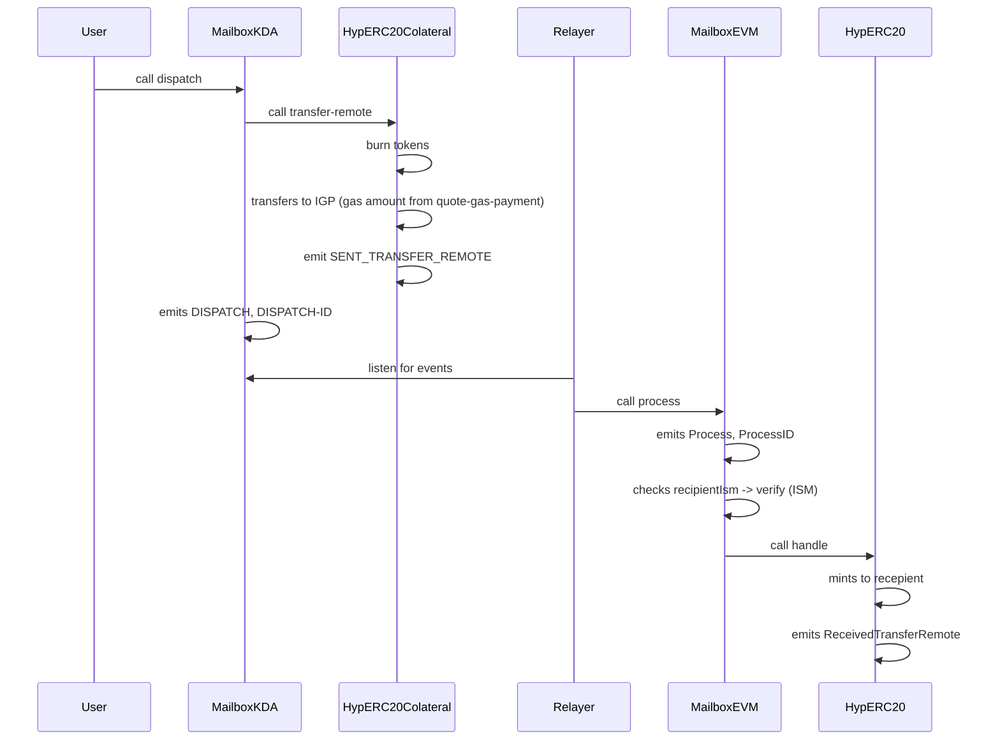
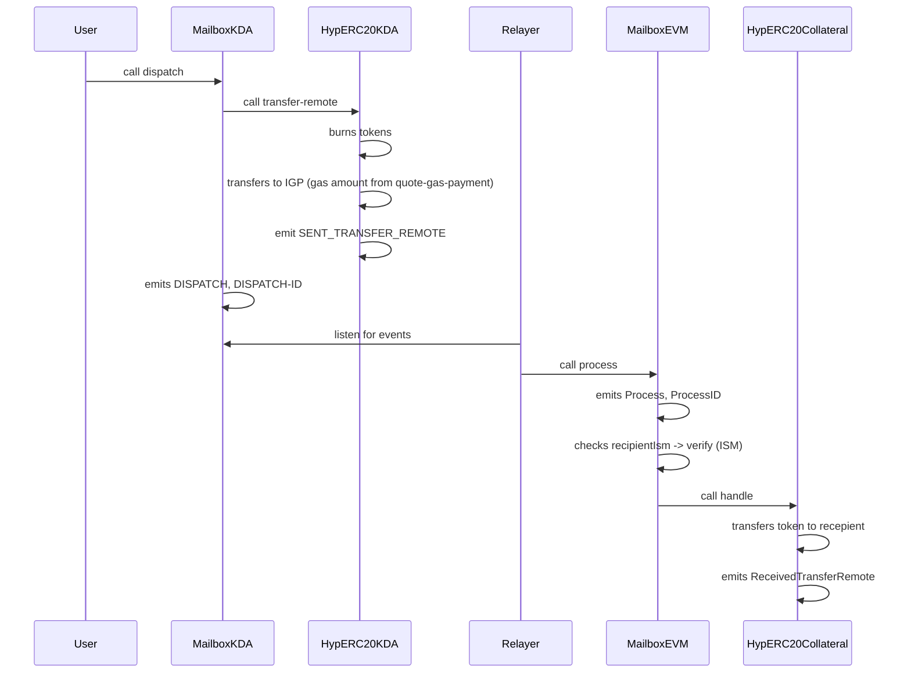
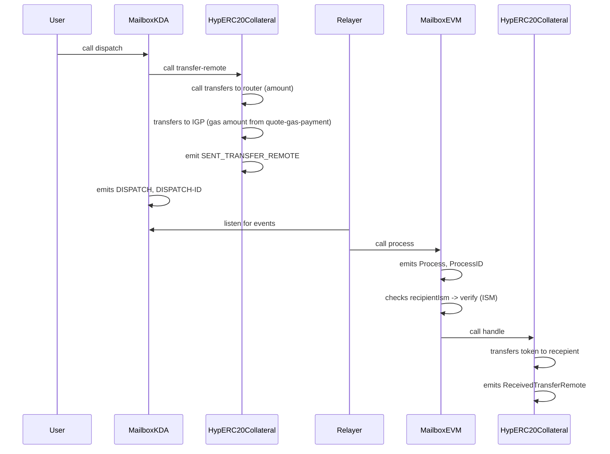

# Sequence Diagram

## From ETH to KDA

### ETH => HypERC20

### HypERC20 => ERC20Collateral

### ERC20Collateral => HypERC20

### ERC20Collateral => ERC20Collateral

## From KDA to ETH

### HypERC20 => ETH 

### HypERC20Collateral => HypERC20

### HypERC20 => HypERC20Collateral 

### HypERC20Collateral => HypERC20Collateral 

