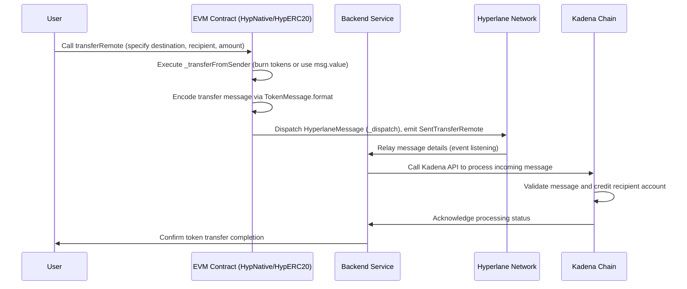

# EVM → Kadena Bridging Documentation

This document details the EVM-to-Kadena token bridging process, explaining both the Solidity contracts on the EVM side and the backend role in relaying messages. The process uses Hyperlane to dispatch token transfer messages and a backend service to coordinate with the Kadena chain.

---

## Overview

The EVM-side bridging logic is implemented in Solidity through contracts that extend a common `TokenRouter` abstraction. Depending on whether native tokens or ERC20 tokens are being bridged, the implementations (e.g., `HypNative` and `HypERC20`) handle token burning (or deduction) on the origin chain and prepare an encoded token transfer message. A backend service listens for dispatched messages (via Hyperlane events) and facilitates communication with the Kadena chain where the recipient account is credited.

---

## Key Components

### 1. TokenRouter (Abstract Contract)

- **Purpose:**  
  Defines the core functionality for dispatching remote token transfers.
- **Key Functions:**
  - `transferRemote`: External function that accepts token amount, destination, and recipient details; calls the internal `_transferRemote`.
  - `_transferRemote`: Prepares a token message using `TokenMessage.format` and dispatches it via Hyperlane.
  - Abstract functions `_transferFromSender` and `_transferTo` are implemented by concrete contracts.
- **Events:**
  - `SentTransferRemote`: Emitted when a transfer message is dispatched.
  - `ReceivedTransferRemote`: Emitted when a transfer message is processed on the destination chain.

### 2. HypNative & HypERC20

- **HypNative:**  
  Handles bridging of native tokens.
  - Uses `msg.value` to determine the token amount and calculates the gas payment for interchain operations.
  - Implements `_transferFromSender` as a no-op since the native amount is handled by `msg.value`.
  - Uses OpenZeppelin’s `Address.sendValue` for transferring tokens on the destination side.
- **HypERC20:**  
  Bridges ERC20 tokens.
  - Burns tokens from the sender using `_transferFromSender` and later mints tokens on the destination via `_transferTo`.
  - Ensures aggregate token supply remains constant across chains.

### 3. TokenMessage Library

- **Purpose:**  
  Provides helper functions to encode and decode the token transfer message.
- **Key Functions:**
  - `format`: Encodes the recipient, token amount, and chain ID into a message.
  - `recipient`, `amount`, and `metadata`: Functions to extract details from the encoded message.

### 4. Backend Service

- **Role:**  
  Acts as the intermediary that listens for Hyperlane events (e.g., `SentTransferRemote`) from the EVM contracts.
- **Responsibilities:**
  - Monitors dispatched token transfer messages.
  - Validates message parameters and relays the transfer details to the Kadena chain.
  - Triggers the corresponding token processing on the Kadena side to credit the recipient.

---

## Sequence Diagram

