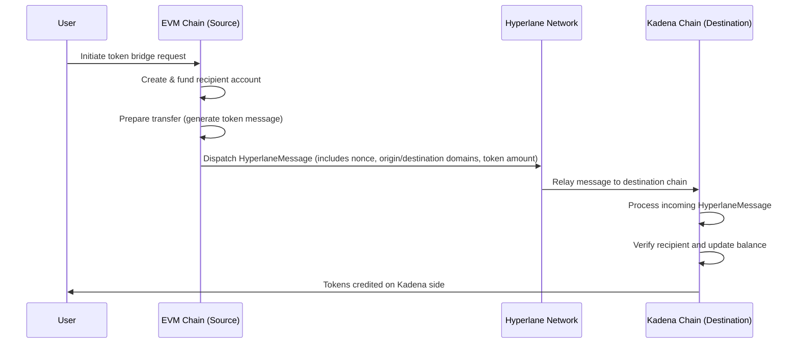

# Bridging Tokens Between Kadena Chainweb and EVM Using Hyperlane

This document provides a high-level overview of the user flows for bridging tokens between Kadena Chainweb and an EVM-compatible chain. The bridging process leverages Hyperlane to relay token transfer messages between the two chains. The diagrams and accompanying details are intended to help engineers understand the core steps involved in both directions.

---

## Overview

Bridging tokens involves several key operations on both the source and destination chains. The process typically includes:

- **Account Preparation:** Creating and funding recipient accounts.
- **Message Dispatch:** Generating and dispatching a Hyperlane message containing the transfer details (including nonce, origin/destination domains, and token amounts).
- **Message Processing:** Verifying the incoming message on the destination chain, updating token balances, and completing the token transfer.
- **Cross-Chain Transfer:** For some operations, executing additional steps such as cross-chain token transfers or processing continuation transactions.

Below are two sequence diagrams that illustrate the bridging flows from EVM to Kadena and from Kadena to EVM.

---

## Bridging Tokens: EVM → Kadena

This flow describes the process where tokens are sent from an EVM chain to a Kadena chain.

